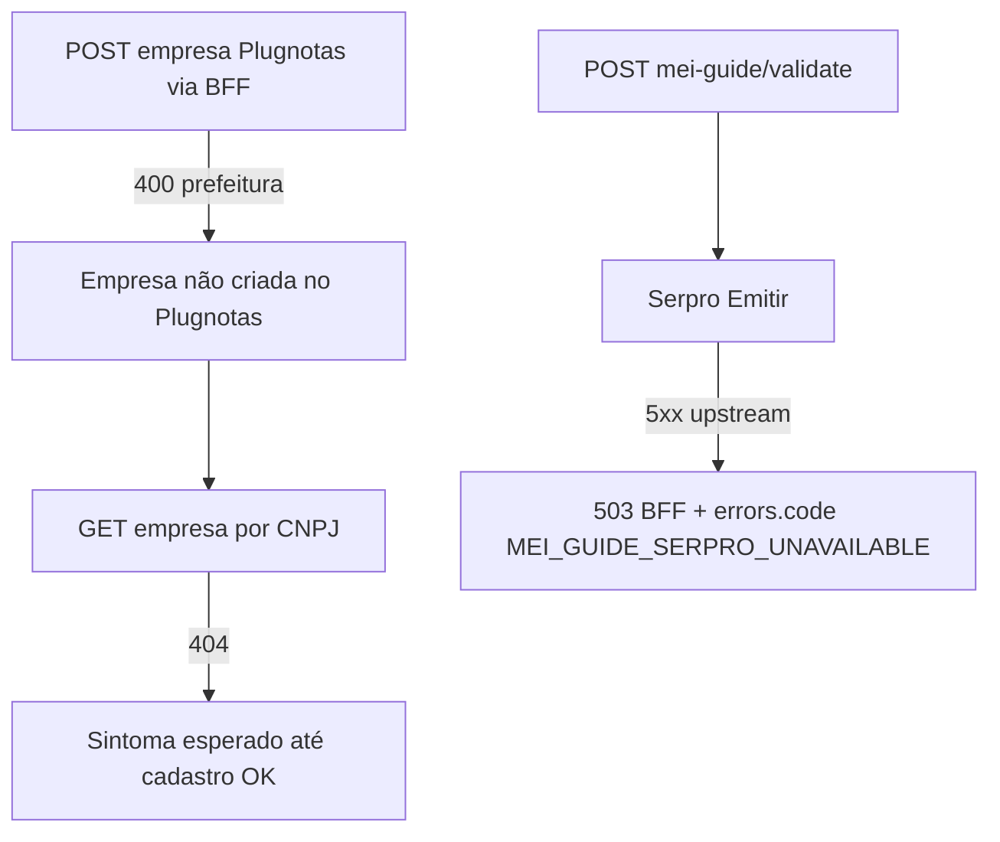

# Operacao MEI/NFSe

**Caminhos relativos:** links para `stories/`, `prd/`, `adr/`, `brief/`, `qa/` neste ficheiro são relativos à pasta **`docs/`** (o próprio ficheiro está em `docs/operacao-mei-nfse.md`). URLs `https://...` são absolutas.  
**Equivalência com stories:** um destino `prd/PRD-….md` aqui é o mesmo ficheiro em `docs/prd/` referido como `../prd/PRD-….md` a partir de `docs/stories/*.md` (critérios de aceite das stories usam frequentemente esta segunda forma).

<a id="guia-mei-escopo-apenas-nfse"></a>

## Escopo da Guia MEI no produto (apenas NFS-e na interface)

- **Limitação D-01 (épico):** o fluxo **Guia MEI** (`GuidesMei`) é voltado a **MEI prestador de serviços**; na **interface** o utilizador **só emite e opera NFS-e** (não há escolha de NF-e nem NFC-e na tela).
- **Inscrição estadual (IE):** o formulário da Guia MEI **não pede** IE da empresa. O backend envia ao Plugnotas o valor definido na política MEI quando a IE não vem do utilizador — hoje **`ISENTO`** (ver `plugnotas-mei-empresa-policy` / ADR de payload apenas NFS-e).
- **Inscrição municipal (IM) e prefeitura (modo NFS-e Nacional):** no fluxo em [`PRD-nfse-nacional-sem-im-prefeitura-mei-2026-04-08.md`](prd/PRD-nfse-nacional-sem-im-prefeitura-mei-2026-04-08.md), a **Guia MEI** **não** inclui campos obrigatórios para IM nem para escolha de prefeitura no **formulário local** de cadastro. O **Plugnotas** pode, ainda assim, devolver erros que exijam dados municipais (conta, ambiente ou política do provedor). Isto **não** significa que o utilizador “faltou preencher” um campo visível na app — ver [Modo NFS-e Nacional no formulário vs exigência municipal na API](#nfse-nacional-vs-municipal-cadastro).
- **Backend e API:** endpoints de NF-e/NFC-e podem existir para outros contextos ou contratos do emissor; na Guia MEI a experiência exposta ao utilizador é **só NFS-e**. Decisão de produto documentada no PRD: [`epic-guia-mei-apenas-nfse-prd.md`](stories/epic-guia-mei-apenas-nfse-prd.md).
- **Erros que citam NFC-e ou `nfce` no JSON:** podem aparecer no **cadastro/atualização da empresa** no Plugnotas (payload enviado pelo app após o certificado), mesmo com a UI de emissão só NFS-e — ver [Cadastro da empresa e NFC-e (QR e SEFAZ)](#cadastro-empresa-nfce-qrcode-sefaz).

<a id="plugnotas-nfse-nacional-spike-nat01"></a>
<a id="emissor-nfse-nacional-spike-nat01"></a>

### NFS-e Nacional no cadastro Plugnotas (NAT-01 / NAT-02 / US-MEI-NAT-03)

#### Default do produto

- O aplicativo envia ao Plugnotas, no cadastro da empresa, o bloco **`nfse`** com **`nacional: true`** por padrão no **`POST /empresa`** (criação), alinhado ao comportamento esperado do painel (*Ativar emissão de NFS-e Nacional*).
- No **`PATCH /empresa/:cnpj`**, o backend **só** inclui ou completa `nfse.nacional` quando o cliente já envia o objeto **`nfse`** no corpo; atualizações que **não** trazem `nfse` **não** alteram a configuração remota desse toggle (evita sobrescrever ajuste feito manualmente no painel). Detalhes: [`ADR-plugnotas-nfse-nacional-empresa-spike.md`](adr/ADR-plugnotas-nfse-nacional-empresa-spike.md).

#### Contrato em código e risco de API (**NFR-N04**)

- O **nome da propriedade** (`nfse.nacional`, boolean) foi **adotado** a partir da primeira hipótese do spike; **não** há, neste repositório, trecho público estável da documentação Plugnotas que prove o mesmo nome em todos os ambientes.
- Se o provedor **rejeitar** o JSON (HTTP **400** com validação de empresa) ou **ignorar** o campo, tratar como possível divergência de contrato: conferir mensagem de erro, abrir ticket com Plugnotas/TecnoSpeed e atualizar o ADR quando houver resposta oficial.

#### Documentação e painel Plugnotas

- **Documentação geral da API:** [docs.plugnotas.com.br](https://docs.plugnotas.com.br/) (acesso pode depender de rede/autenticação; na prática o time costuma cruzar com o painel).
- **Painel web:** [app2.plugnotas.com.br](https://app2.plugnotas.com.br) — após cadastro pelo app, verificar na ficha da empresa se a opção de **NFS-e Nacional** reflete o esperado (homologação/produção conforme a conta).

#### Município, credenciamento e rejeições

- A **NFS-e Nacional** depende de **adesão municipal/prestador** e regras do provedor. Mesmo com `nacional: true` no payload, podem ocorrer:
  - **400** ou mensagens de validação no cadastro ou na emissão;
  - comportamento em que o painel **não** exibe nacional ativa (município ainda só no modelo antigo, CNPJ sem credenciamento adequado, etc.).
- **Não** concluir automaticamente que o app “não enviou o campo” antes de comparar o **corpo da requisição** (logs redigidos de cadastro empresa, com opt-in `PLUGNOTAS_DEBUG` em produção) com a resposta do Plugnotas.

<a id="nfse-nacional-vs-municipal-cadastro"></a>

#### Modo NFS-e Nacional no formulário vs exigência municipal na API (**FR-NAT-DOC-01**)

- **No produto (Guia MEI, painel DAS):** o cadastro orientado a **NFS-e Nacional** envia `nfse.nacional: true` conforme [`ADR-plugnotas-nfse-nacional-empresa-spike.md`](adr/ADR-plugnotas-nfse-nacional-empresa-spike.md) e **não** acrescenta IM nem prefeitura ao payload a partir de campos do formulário descritos no PRD abaixo.
- **Resposta da API:** mensagens que citam `inscricaoMunicipal`, inscrição municipal, prefeitura ou `nfse.config` municipal indicam **tensão entre modo nacional escolhido no produto e validações que o emissor aplica** (limitação de conta, homologação vs produção, ou regra ainda municipal na ponta). **NFR-N04:** painel web e corpo de erro podem **divergir** até existir evidência fechada (ticket ou doc oficial do provedor); não prometa em nome do produto que a emissão está **legalmente** autorizada ou homologada em todos os municípios.
- **Referências de produto e engenharia:** PRD [`PRD-nfse-nacional-sem-im-prefeitura-mei-2026-04-08.md`](prd/PRD-nfse-nacional-sem-im-prefeitura-mei-2026-04-08.md); especificação de UX [`ux-spec-nfse-nacional-sem-im-prefeitura-mei-2026-04-08.md`](specs/ux-spec-nfse-nacional-sem-im-prefeitura-mei-2026-04-08.md); nota de arquitetura [`architecture-nfse-nacional-sem-im-prefeitura-mei-2026-04-08.md`](technical/architecture-nfse-nacional-sem-im-prefeitura-mei-2026-04-08.md).
- **Sintomas na interface:** copy de ajuda e painel de retry âmbar quando a heurística municipal dispara — ver [Mensagens Plugnotas → dica na Guia MEI](#plugnotas-nfse-nacional-erros-mensagens) e `frontend/src/utils/nfseNacionalPlugnotasErrorHints.ts`.

<a id="nfse-config-prefeitura-cadastro-pref"></a>

#### `nfse.config.prefeitura` obrigatório vs inscrição municipal na raiz (**FR-PREF-DOC-01**)

- O Plugnotas pode devolver **400** citando `fields.nfse.config.prefeitura` ou `nfse.config.prefeitura` (preenchimento obrigatório). Isto é **distinto** do campo **`inscricaoMunicipal`** ao nível raiz do JSON de empresa: preencher a IM opcional na Guia MEI **não** substitui a configuração de prefeitura dentro de **`nfse.config`** quando o validador exige esse ramo.
- **Produto / UX:** PRD [`PRD-plugnotas-empresa-nfse-config-prefeitura-payload-2026-04-08.md`](prd/PRD-plugnotas-empresa-nfse-config-prefeitura-payload-2026-04-08.md); spec [`ux-spec-plugnotas-nfse-config-prefeitura-payload-2026-04-08.md`](specs/ux-spec-plugnotas-nfse-config-prefeitura-payload-2026-04-08.md); arquitetura [`architecture-plugnotas-nfse-config-prefeitura-payload-2026-04-08.md`](technical/architecture-plugnotas-nfse-config-prefeitura-payload-2026-04-08.md).
- **Interface:** quando a mensagem casa com a variante **PREF-L1**, a Guia MEI mostra copy que explica a diferença (painel âmbar de retry e painel vermelho de erro) — funções `isPlugnotasNfseConfigPrefeituraRequirementMessage` e `getPlugnotasEmpresaCadastroErrorUxVariant` em `frontend/src/utils/nfseNacionalPlugnotasErrorHints.ts`.
- **PREF-L2 (spec UX §3.2):** exigências municipais **só** com inscrição municipal (sem gatilho L1) usam a mesma copy genérica municipal (**NAT §5.2**); no código isto corresponde à variante interna `'municipal-generic'` (não a `'prefeitura-config'`).
- **Consulta GET empresa após falha no registo:** se o utilizador ainda tem o painel de **retry** (cadastro da empresa não concluído) e a consulta devolve “não encontrado” / **404**, a app pode prefixar a mensagem com orientação para resolver o erro de registo antes de interpretar como CNPJ errado.
- **FR-CONS (P1) — triade UX / CONS-B:** o mesmo prefixo (UX §5.4) aplica-se quando o painel de retry **já não** está visível mas o marcador de sessão SOL-P1 (`guiaMeiEmpresaFase2FailFlag`) indica falha recente no POST fase 2 — `withPlugnotasEmpresaConsultPendingCadastroPrefixIfApplicable` com `sessionPostFailedFlag`. Erros de validação guia / Serpro (CONS-C) **não** disparam dica NFS-e Nacional / municipal na heurística — `shouldOfferNfseNacionalOperacaoDocHint` em `nfseNacionalPlugnotasErrorHints.ts`; story [`story-fr-cons-p1-guidesmei-fr-cons-ux-paridade-sol.md`](stories/story-fr-cons-p1-guidesmei-fr-cons-ux-paridade-sol.md).
- **Payload com `prefeitura` preenchida** no `nfse.config` — ver fecho do spike P0 e evidência redigida: [`NFR-PREF-EV-01-plugnotas-prefeitura-spike-p0-closure-2026-04-08.md`](evidence/NFR-PREF-EV-01-plugnotas-prefeitura-spike-p0-closure-2026-04-08.md) (**FR-P0-SPIKE-01**, **FR-P0-DOC-01**). Trilhos **C/D** permanecem stories condicionais no mesmo eixo PRD PREF.

<a id="p0-prefeitura-spike-trilho-b"></a>

##### Spike P0 — decisão trilho **B** (`nfse.config.prefeitura`)

- **PRD P0 (ação cadastro):** [`PRD-acao-p0-cadastro-empresa-prefeitura-400-get-404-2026-04-08.md`](prd/PRD-acao-p0-cadastro-empresa-prefeitura-400-get-404-2026-04-08.md).
- **Decisão registada:** trilho **B** — o backend pode preencher **`nfse.config.prefeitura.codigoIbge`** a partir de **`endereco.codigoCidade`** (7 dígitos), **somente** com **`PLUGNOTAS_NFSE_PREFEITURA_DERIVE_IBGE=true`** (defeito desligado — **NFR-P0-REG-01**). Detalhes: [`ADR-plugnotas-empresa-payload-apenas-nfse.md`](adr/ADR-plugnotas-empresa-payload-apenas-nfse.md) (complemento 2026-04-08), story [`story-fr-cons-p0-plugnotas-empresa-backend-trilho-b-nfse-prefeitura.md`](stories/story-fr-cons-p0-plugnotas-empresa-backend-trilho-b-nfse-prefeitura.md).
- **Evidência / spike (sem PII):** [`evidence/NFR-PREF-EV-01-plugnotas-prefeitura-spike-p0-closure-2026-04-08.md`](evidence/NFR-PREF-EV-01-plugnotas-prefeitura-spike-p0-closure-2026-04-08.md).
- **Trilho A** (ajuste só no painel Plugnotas) não foi escolhido como **único** encerramento do P0; as secções **Sandbox vs produção** e **Checklist manual pós-cadastro** mais abaixo neste runbook continuam válidas para qualquer trilho.
- **FR-P0-OUT-01 / 02** (POST 2xx + GET coerente no ambiente acordado): fechar com evidência **interna** (ticket/QA) **sem** CNPJ nem chaves no Git.
- **NFR-PREF-EV-01 (produção):** antes do primeiro deploy com **`PLUGNOTAS_NFSE_PREFEITURA_DERIVE_IBGE=true`** em ambiente real, validar conta/sandbox conforme nível **B** em [`NFR-PREF-EV-01-plugnotas-prefeitura-spike-p0-closure-2026-04-08.md`](evidence/NFR-PREF-EV-01-plugnotas-prefeitura-spike-p0-closure-2026-04-08.md) §8 e anexar registo redigido ao processo de release (fora do Git se contiver dados sensíveis).

<a id="cadastro-post-404-get-empresa"></a>

#### Encadeamento **POST** cadastro empresa → **GET** **404** (**FR-SOL-DIAG-01**, **FR-SOL-ANT-01**)

- Se o **`POST`** `…/emissao-fiscal/empresa` falhar (ex.: **400** com `nfse.config.prefeitura` **ou** **400** com validação de **cidade IBGE** / tabela de municípios em `endereco`), o Plugnotas **não** cria a empresa na conta; um **`GET`** `…/emissao-fiscal/empresa?cpfCnpj=` pode devolver **404** (*não localizamos empresa*). Isto é **esperado**: o **404** não indica por si um “bug só da consulta” — trata primeiro o erro do **envio** (POST) ou conclui o cadastro com sucesso antes de esperar dados na consulta. Distinção entre tipos de **400**: [400 cadastro empresa: qual erro?](#cadastro-empresa-400-qual-erro). Consolidação para suporte: [Triagem: erros na consola do browser](#triagem-erros-consola-guia-mei) (**FR-CONS-MAP-01**).
- **Antipadrões:** (1) assumir que **inscrição municipal** na raiz do JSON substitui **`nfse.config.prefeitura`** quando o erro citar esse campo — ver [secção PREF](#nfse-config-prefeitura-cadastro-pref); (2) **repetir só o GET** esperando 200 sem corrigir o POST; (3) assumir que **`nfse.nacional: true`** no payload dispensa **`prefeitura`** em **todas** as contas (**NFR-N04**).
- **Produto / UX:** PRD [`PRD-solucao-400-prefeitura-404-get-empresa-mei-2026-04-08.md`](prd/PRD-solucao-400-prefeitura-404-get-empresa-mei-2026-04-08.md); spec [`ux-spec-solucao-400-prefeitura-404-get-empresa-mei-2026-04-08.md`](specs/ux-spec-solucao-400-prefeitura-404-get-empresa-mei-2026-04-08.md); arquitetura [`architecture-solucao-400-prefeitura-404-get-empresa-mei-2026-04-08.md`](technical/architecture-solucao-400-prefeitura-404-get-empresa-mei-2026-04-08.md). A Guia MEI mostra blocos contextuais (`PlugnotasEmpresaCadastroSolContextPanel`) e heurística `resolvePlugnotasEmpresaCadastroSolUxState` em `frontend/src/utils/plugnotasEmpresaCadastroSolUx.ts`.
- **Marcador de sessão (SOL-L2 / P1):** após falha confirmada do POST fase 2 (cadastro empresa), o cliente grava em `sessionStorage` a chave `mei:empresaFase2Fail:v1:${userId}:${cnpj14}` com **apenas** `{ t: number }` (TTL ~30 min; sem texto de erro). Limpeza após POST 2xx de empresa ou GET com dados de cadastro parseáveis; expirado → UX volta ao estado neutro **SOL-L3**. Código: `frontend/src/utils/guiaMeiEmpresaFase2FailFlag.ts`.

<a id="endereco-codigo-cidade-ibge-plugnotas"></a>

#### `endereco.codigoCidade` e tabela de municípios IBGE (**FR-CID-DOC-01**)

- O Plugnotas pode devolver **400** com validação do tipo *valor não encontrado na tabela de cidades do IBGE* ou menção a **`fields.endereco.codigoCidade`**. Isto é **distinto** de erros sobre **`nfse.config.prefeitura`** ou só inscrição municipal — ver secção [acima](#nfse-config-prefeitura-cadastro-pref).
- **Formato técnico:** o aplicativo normaliza o código para **string com apenas dígitos** (7 dígitos típicos de município IBGE) no cliente e no servidor antes de `POST`/`PATCH` `/empresa`, para evitar rejeição só por tipo JSON (ex.: número vs string) ou caracteres não numéricos colados na consulta CNPJ.
- **Dados incorrectos na fonte:** se, após normalização, o **conteúdo** ainda não existir na tabela que o emissor usa, o **400** pode persistir — aí o utilizador deve conferir município e código no cadastro CNPJ ou na base oficial do IBGE; não é falha de “formato” corrigível só no app.
- **Referências:** PRD [`PRD-plugnotas-empresa-codigo-cidade-ibge-2026-04-08.md`](prd/PRD-plugnotas-empresa-codigo-cidade-ibge-2026-04-08.md); arquitetura [`architecture-plugnotas-empresa-codigo-cidade-ibge-2026-04-08.md`](technical/architecture-plugnotas-empresa-codigo-cidade-ibge-2026-04-08.md).
- **Quadro consolidado** (CID vs TIBGE vs PREF) e **runbook** de escalação: [400 cadastro empresa: qual erro?](#cadastro-empresa-400-qual-erro) e [Runbook: rejeição IBGE com código aparentemente correcto](#cadastro-empresa-erro-ibge-tabela).

<a id="cadastro-empresa-400-qual-erro"></a>
<a id="cadastro-empresa-erro-ibge-tabela"></a>

#### 400 cadastro empresa: qual erro? — **CID** vs **TIBGE** vs **PREF** (**FR-TIBGE-DOC-01**)

Use esta tabela para desambiguar mensagens de validação no **`POST`** `…/emissao-fiscal/empresa` antes de abrir ticket no provedor ou assumir bug só do **`GET`**.

| Tema | O que é | Sintomas típicos na mensagem | PRD / artefactos |
| --- | --- | --- | --- |
| **CID** (formato / tipo) | Normalização de **`endereco.codigoCidade`**: string só com dígitos, paridade cliente ↔ BFF; evita **400** só por número vs string ou caracteres estranhos. | Erros de tipo, serialização, ou texto que indique formato inválido **antes** de falar em “tabela IBGE” no sentido semântico. | [`PRD-plugnotas-empresa-codigo-cidade-ibge-2026-04-08.md`](prd/PRD-plugnotas-empresa-codigo-cidade-ibge-2026-04-08.md); [`architecture-plugnotas-empresa-codigo-cidade-ibge-2026-04-08.md`](technical/architecture-plugnotas-empresa-codigo-cidade-ibge-2026-04-08.md) |
| **TIBGE** (tabela do emissor) | O **conteúdo** do código (7 dígitos) **não existe** na tabela de municípios que o **Plugnotas** usa, ou está **incoerente** com cidade/UF (dados CNPJ desactualizados, homónimos). A mensagem pode citar **`fields.endereco.codigoIBGECidade`** — no **payload** da app o campo canónico continua **`endereco.codigoCidade`**. | *«…não encontrada na tabela de cidades do IBGE»*, *«codigoIBGECidade»*, `fields.endereco.codigoCidade` com falha de lookup. | [`PRD-correcao-ibge-tabela-plugnotas-400-get-404-2026-04-09.md`](prd/PRD-correcao-ibge-tabela-plugnotas-400-get-404-2026-04-09.md); [`ux-spec-correcao-ibge-tabela-plugnotas-400-get-404-2026-04-09.md`](specs/ux-spec-correcao-ibge-tabela-plugnotas-400-get-404-2026-04-09.md); [`architecture-correcao-ibge-tabela-plugnotas-400-get-404-2026-04-09.md`](technical/architecture-correcao-ibge-tabela-plugnotas-400-get-404-2026-04-09.md) |
| **PREF** / **SOL** | Configuração municipal no ramo **`nfse.config`** (ex.: **`nfse.config.prefeitura`**) ou narrativa **POST falhou → GET 404**. | `nfse.config.prefeitura` obrigatório; encadeamento com [404 no GET](#cadastro-post-404-get-empresa). | PREF: [`PRD-plugnotas-empresa-nfse-config-prefeitura-payload-2026-04-08.md`](prd/PRD-plugnotas-empresa-nfse-config-prefeitura-payload-2026-04-08.md); SOL: [`PRD-solucao-400-prefeitura-404-get-empresa-mei-2026-04-08.md`](prd/PRD-solucao-400-prefeitura-404-get-empresa-mei-2026-04-08.md), [Encadeamento POST → GET 404](#cadastro-post-404-get-empresa) |

**Nota:** **NFR-TIBGE-01** — não há neste produto uma cópia local completa da tabela IBGE para substituir a do emissor; a correcção passa por dados correctos e, em último caso, ticket ao **Plugnotas** (ver runbook abaixo).

##### Runbook — rejeição cidade IBGE / tabela (**FR-TIBGE-OPS-01**)

1. No DevTools (rede), confirmar o valor enviado em **`endereco.codigoCidade`** no corpo do **POST** (após normalização no cliente).  
2. Comparar com a [consulta oficial de municípios IBGE](https://www.ibge.gov.br/explica/codigos-dos-municipios-do-brasil-1670360003609) para o **mesmo** município e UF do formulário.  
3. Se o código estiver **incorrecto** — corrigir dados (manual ou nova consulta CNPJ) e repetir o **POST**.  
4. Se o código estiver **correcto** na fonte IBGE e o **400** persistir — abrir **ticket** junto do **Plugnotas** (ambiente, conta, código IBGE; CNPJ apenas conforme política do fornecedor) e registar evidência interna em [`docs/evidence/`](evidence/) quando aplicável (**sem** PII em repositório público).  
5. **GET 404** após falha do **POST** — comportamento **esperado** até existir **POST** 2xx; ver [Encadeamento POST → GET 404](#cadastro-post-404-get-empresa).

#### Sandbox vs produção (**NFR-N04**)

- **`PLUGNOTAS_API_BASE_URL`** e **`PLUGNOTAS_API_KEY`** devem ser da **mesma conta** e do **mesmo ambiente** (sandbox **ou** produção). Cadastrar em sandbox e inspecionar em produção (ou o inverso) gera inconsistência e falso diagnóstico sobre `nfse.nacional`.
- O comportamento do campo pode variar entre ambientes; qualquer evidência formal (aceite/rejeição) deve registrar **qual URL base** e **qual conta** foram usadas.

#### Checklist manual pós-cadastro (evidência operacional — **FR-N02**)

Use em **homologação/sandbox** (recomendado) antes de repetir em produção:

1. Configurar backend com `PLUGNOTAS_API_BASE_URL` / `PLUGNOTAS_API_KEY` de **sandbox**.
2. Na Guia MEI, concluir fluxo **certificado A1** + **cadastro da empresa** com CNPJ e dados válidos para o ambiente.
3. No painel Plugnotas (mesma conta), localizar a empresa pelo CNPJ e verificar o estado do controle **NFS-e Nacional** (ligado / disponível conforme UI do provedor).
4. Se houver **400** no cadastro, copiar a mensagem exibida ao utilizador e, se possível, o trecho relevante do log redigido do servidor (`PLUGNOTAS_DEBUG` se necessário) para suporte interno — **sem** colar `x-api-key` nem PII completa em tickets públicos.

5. **Após executar** o checklist em sandbox (ou homologação), **registar** data, `PLUGNOTAS_API_BASE_URL` usada (sem expor API key) e resultado (ex.: nacional refletida no painel / 400 com mensagem X) nas **QA Results** da story **US-MEI-NAT-03** no épico ou em ticket interno — fecha o ciclo **FR-N02** além do artefato estático.

PRD de produto: [`PRD-nfse-nacional-default-cadastro-plugnotas.md`](prd/PRD-nfse-nacional-default-cadastro-plugnotas.md). Épico: [`epic-nfse-nacional-plugnotas-prd.md`](stories/epic-nfse-nacional-plugnotas-prd.md) (**US-MEI-NAT-03**).

<a id="plugnotas-nfse-nacional-erros-mensagens"></a>

### Mensagens Plugnotas → dica na Guia MEI (**US-MEI-NAT-04**, **FR-N05**)

O frontend não reparseia JSON do emissor: usa a **string de erro** já consolidada pelo backend (`message` / `details`). Quando a heurística abaixo casa, a UI exibe texto de ajuda curto e um link para esta secção de cadastro nacional (âncoras `#plugnotas-nfse-nacional-spike-nat01` ou `#emissor-nfse-nacional-spike-nat01`, esta última igual à constante `NFSE_NACIONAL_OPERACAO_DOC_ANCHOR` no código), ou para `frontend/public/guia-mei-nfse-nacional.html#emissor-nfse-nacional-spike-nat01` quando `VITE_MEI_OPERACAO_NFSE_DOC_URL` **não** está definido.

| Disparo (texto normalizado: minúsculas, sem acento) | Comportamento na UI |
| --- | --- |
| Substring `nfse.nacional` | Dica + link |
| `nfs-e nacional`, `nfse nacional` ou `nfs e nacional` | Dica + link |
| `emissao nacional` | Dica + link |
| `ambiente nacional` | Dica + link |
| `nota nacional` **e** (`nfse` ou `servico` / nota de serviço) | Dica + link |
| `nacional` **e** (`municipio`, `prefeitura`, `credenci`, `aderiu`, `adesao`) | Dica + link |
| `nacional` **e** (`indispon`, `nao dispon`, `nao suport`) | Dica + link |
| `plugnotas` **e** `nacional` **e** (`nfse` ou `nfs`) | Dica + link |
| **`inscricaomunicipal`**, inscrição municipal ou (`inscricao` **e** `municipal`) | Dica + link (+ parágrafo **FR-NAT-ERR-01** quando a UI mostra a explicação municipal) |
| `prefeitura` **e** contexto de cadastro fiscal (`nfse`, `emitente`, `empresa`, `cadastro`, `plugnotas`, `nfse.config`, `config.prefeitura`) — **não** aplica se só `nfce` sem `nfse` | Idem |

**Implementação:** `frontend/src/utils/nfseNacionalPlugnotasErrorHints.ts` (lista `NFSE_NACIONAL_PLUGNOTAS_HINT_PATTERNS_DOC` + testes: manter alinhamento com esta tabela). **Onde aparece:** `GuiaMeiEmpresaCadastroErrorPanel`, `EmissaoFiscalErrorAlert`, `EmissaoFiscalErrorAlertModal` (link com tom `rose` no modal), `PlugnotasIntegrationErrorAlert`, painel âmbar de retry em `GuidesMei.tsx`, e corpo partilhado `PlugnotasMunicipalRequirementOperacaoCopy.tsx`.

Épico: [`epic-nfse-nacional-plugnotas-prd.md`](stories/epic-nfse-nacional-plugnotas-prd.md) (**US-MEI-NAT-04**).

<a id="triagem-erros-consola-guia-mei"></a>

## Triagem: erros na consola do browser (Guia MEI) (**FR-CONS-MAP-01**)

**Princípio:** na [spec UX CONS](specs/ux-spec-correcao-cadastro-plugnotas-erros-console-mei-2026-04-08.md) (secção 2 — mapa de specs), **consola ≠ UI**: o painel da Guia MEI pode humanizar ou encadear mensagens; na aba **Rede** aparecem pedidos distintos ao BFF. Esta secção consolida a **tríade** mais comum de incidentes — **sem PII de exemplo** — para suporte e engenharia correlacionarem sintoma e sistema certo (Plugnotas vs Serpro).

### Mapa rápido — endpoint × sintoma × causa provável × próximo passo

| Gatilho | Pedido BFF (típico) | Sintoma na rede / consola | Causa provável | Próximo passo |
| --- | --- | --- | --- | --- |
| **CONS-B** (cadastro / consulta empresa) | `GET /api/mei-notas/setup/emissao-fiscal/empresa?cpfCnpj=` | **404** (`success: false` no JSON da app) | Depois de um **`POST` empresa falhado**, o Plugnotas **não criou** a empresa na conta; o **404 é esperado** até existir registo aceite. **Não** é, por si só, “bug só da consulta”. | Tratar primeiro o **erro do `POST`** (ex.: **400** `prefeitura` ou **400** cidade IBGE) ou concluir o cadastro com sucesso antes de esperar **200** no GET. Ver [Encadeamento POST → GET 404](#cadastro-post-404-get-empresa). |
| **CONS-A / PREF** | `POST` ou `PATCH …/emissao-fiscal/empresa` | **400** com texto citando **`nfse.config.prefeitura`** ou `fields.nfse.config.prefeitura` | Validador do **Plugnotas** exige configuração de prefeitura dentro de **`nfse.config`**; é **distinto** de preencher só **`inscricaoMunicipal`** na raiz do JSON. | PRD [**FR-PREF**](prd/PRD-plugnotas-empresa-nfse-config-prefeitura-payload-2026-04-08.md), spec UX PREF e [secção PREF neste runbook](#nfse-config-prefeitura-cadastro-pref). |
| **CONS-A / TIBGE** (cidade IBGE) | `POST` ou `PATCH …/emissao-fiscal/empresa` | **400** citando **tabela de cidades do IBGE**, `codigoIBGECidade`, `fields.endereco.codigoCidade` com lookup inválido | Código de município **rejeitado pela tabela do emissor** ou incoerente com endereço — **distinto** de [CID](#cadastro-empresa-400-qual-erro) (só formato) e de [PREF](#nfse-config-prefeitura-cadastro-pref). | [400 cadastro empresa: qual erro?](#cadastro-empresa-400-qual-erro), [Runbook IBGE](#cadastro-empresa-erro-ibge-tabela), PRD [**FR-TIBGE**](prd/PRD-correcao-ibge-tabela-plugnotas-400-get-404-2026-04-09.md). |
| **CONS-C** (validate guia / Serpro) | `POST /api/mei-guide/validate` | **HTTP 503** com `errors.code: MEI_GUIDE_SERPRO_UNAVAILABLE` e `integration: serpro` *(contrato pós [P0 Serpro](stories/story-fr-cons-p0-serpro-emitir-503-mei-guide-validate.md))*; em cenários legados pode ainda aparecer **400** com mensagem genérica até alinhar cliente | Falha **5xx** ou indisponibilidade no **Serpro** (`/Emitir`); **não** desbloqueia cadastro no Plugnotas nem substitui correção de **`prefeitura`**. | Copy **CONS-C** na UI (spec UX CONS §6); orientar “tentar mais tarde” / canal Receita, **sem** misturar com NFS-e Nacional ou painel de empresa. |

### Ordem de verificação sugerida (suporte)

1. Identificar **qual** pedido falhou por último no fluxo que o utilizador descreveu (empresa **vs** validate).  
2. Se houver **400** em **`…/empresa`**, resolver **PREF / payload / ambiente Plugnotas** antes de interpretar um **404** subsequente no GET.  
3. Se o sintoma for **`…/mei-guide/validate`** com **503** + código Serpro, **não** redireccionar o utilizador para checklist de cadastro Plugnotas como causa única.

### Diagrama — cadeia causal (resumo)

Fluxo equivalente ao [brief da consola](brief/brief-correcao-cadastro-plugnotas-erros-console-2026-04-08.md) e ao diagrama de sequência na [arquitetura CONS](technical/architecture-correcao-cadastro-plugnotas-erros-console-mei-2026-04-08.md) (§1.2); versão operacional:



### Artefactos relacionados (ponteiro; copy detalhada nas specs)

| Artefacto | Link |
| --- | --- |
| PRD CONS (requisitos) | [`PRD-correcao-cadastro-plugnotas-erros-console-mei-2026-04-08.md`](prd/PRD-correcao-cadastro-plugnotas-erros-console-mei-2026-04-08.md) |
| Brief — cadeia na consola | [`brief-correcao-cadastro-plugnotas-erros-console-2026-04-08.md`](brief/brief-correcao-cadastro-plugnotas-erros-console-2026-04-08.md) |
| Spec UX CONS (CONS-A/B/C) | [`ux-spec-correcao-cadastro-plugnotas-erros-console-mei-2026-04-08.md`](specs/ux-spec-correcao-cadastro-plugnotas-erros-console-mei-2026-04-08.md) |
| Arquitetura CONS | [`architecture-correcao-cadastro-plugnotas-erros-console-mei-2026-04-08.md`](technical/architecture-correcao-cadastro-plugnotas-erros-console-mei-2026-04-08.md) |
| Spec SOL (400 + 404 GET) | [`ux-spec-solucao-400-prefeitura-404-get-empresa-mei-2026-04-08.md`](specs/ux-spec-solucao-400-prefeitura-404-get-empresa-mei-2026-04-08.md) |

### Rastreio em stories (**FR-CONS-EVID-01**)

As stories de implementação **FR-CONS P0/P1** devem referenciar esta âncora no **Dev Agent Record** / checklist: **`docs/operacao-mei-nfse.md#triagem-erros-consola-guia-mei`**. Exemplos: [P0 Serpro 503](stories/story-fr-cons-p0-serpro-emitir-503-mei-guide-validate.md), [P1 paridade SOL/CONS na Guia MEI](stories/story-fr-cons-p1-guidesmei-fr-cons-ux-paridade-sol.md), [P1 runbook tríade](stories/story-fr-cons-p1-operacao-mei-nfse-triade-erros-consola.md).

### Revisão operação (informal)

Registar **OK** na story [STORY-FR-CONS-P1-OPERACAO-TRIADE](stories/story-fr-cons-p1-operacao-mei-nfse-triade-erros-consola.md) ou comentário no MR após leitura desta secção *(critério de aceite da story)*.

---

## Objetivo
Registrar pre-condicoes, variaveis de ambiente e orientacoes basicas para operacao do fluxo MEI/NFSe.

**Smoke E2E NF-e / NFC-e (sandbox):** runbook reproduzível em [`runbook/runbook-smoke-nfe-nfce-plugnotas-sandbox.md`](runbook/runbook-smoke-nfe-nfce-plugnotas-sandbox.md) (PRD POSQA **FR-POSQA-01** / **FR-POSQA-02**).

**Erro comum na emissão:** se a UI ou o backend mostrarem mensagem no sentido de *falha na validacao do JSON* vinda do emissor, consulte a seção [Mensagem: Falha na validacao do JSON](#mensagem-falha-na-validacao-do-json) (troubleshooting por tipo de nota e checklist).

## Pre-condicoes
1. Backend configurado com Supabase e credenciais da integracao externa.
2. Usuario autenticado para acessar endpoints protegidos de NFSe.
3. Frontend apontando para backend correto via `VITE_API_URL`.

## Antes de atribuir erro ao Plugnotas (conectividade local)

<a id="guia-mei-conectividade-local"></a>

Se a Guia MEI mostrar **Failed to fetch**, **`TypeError: Failed to fetch`** ou **`net::ERR_CONNECTION_REFUSED`** no DevTools **antes** de aparecer um **status HTTP** (200, 400, 401, etc.) na requisição, a causa provável é **falta de conexão com o backend deste aplicativo**, não uma rejeição do **provedor Plugnotas**. O fluxo de **certificado A1** na guia chama o seu servidor em **`POST /api/mei-guide/certificate`** (multipart); sem backend no ar, essa chamada falha na origem.

**Checklist mínimo (desenvolvimento local)**

1. **Subir o backend** na porta esperada pelo proxy do frontend (padrão do repositório: **`3333`**, ver `PORT` em `backend/.env` e `frontend/vite.config.ts` → `server.proxy['/api'].target`).
2. **Subir o frontend** (Vite; porta padrão **`3000`**, ver `frontend/vite.config.ts` → `server.port`).
3. **Validar saúde do backend** com requisição direta à **raiz do servidor**, **fora** do prefixo montado em `/api`:
   - `GET http://localhost:3333/health` → corpo esperado `{"status":"ok"}` (definido em `backend/src/server.js`).
   - **Nota:** o proxy do Vite encaminha apenas caminhos que começam com **`/api`**. O **`/health`** de smoke test deve ir à **porta do Express** (ex.: `3333`), não à origem do Vite (`3000`), salvo configuração explícita diferente.
4. **Só então** enviar o certificado na Guia MEI. Em DEV, o browser costuma chamar `http://localhost:3000/api/...`; o Vite **repassa** `/api` para `http://localhost:3333`.

Se o backend estiver parado, o sintoma típico é falha de rede no envio do certificado — **não** conclua que o Plugnotas recusou o cadastro até existir **resposta HTTP** do seu backend com mensagem do emissor.

**Referências**

- Brief (análise do caso): [`docs/brief/brief-failed-to-fetch-guia-mei-certificado.md`](brief/brief-failed-to-fetch-guia-mei-certificado.md)
- PRD: [`docs/prd/PRD-guia-mei-conectividade-backend-failed-to-fetch.md`](prd/PRD-guia-mei-conectividade-backend-failed-to-fetch.md)

## Variaveis de Ambiente Criticas (Backend)
- `PLUGNOTAS_API_BASE_URL`
- `PLUGNOTAS_API_PATH_PREFIX` (opcional; ex.: `/api` se a API oficial exigir segmento antes de `/empresa`, `/nfse`, etc.)
- `PLUGNOTAS_API_KEY`
- `PLUGNOTAS_DEBUG` (opcional; valores **truthy** interpretados como `true` **sem diferenciar maiúsculas** / `True` / `TRUE`). **Opt-in explícito** em **produção** para logs extras do Plugnotas (ex.: `[plugnotas] …`, `[plugnotas empresa cadastro] POST|PATCH … 400 request payload (redacted):` com JSON **redigido** em **400** de `POST /empresa` e `PATCH /empresa/:cnpj`). **Sem** flag em produção esse payload **não** é impresso. Fora de produção (`NODE_ENV !== 'production'`), o log de cadastro empresa pode aparecer **sem** a flag. Redação: `redactPayload` + máscara leve de PII cadastral (razão social, endereço, email, CEP, inscrições) em `plugnotas-empresa-cadastro-debug.js`; **nunca** headers nem `x-api-key`.)
- `PLUGNOTAS_CERT_409_RESOLVE_LOG_LEVEL` (opcional; **padrão `warn`** em `backend/src/config/env.js`). Controla o destino (`console.error`/`warn`/`info`/`debug`) das mensagens `[plugnotas] certificado 409 resolve` emitidas em **`resolverCertificadoIdAposConflito409`** quando o POST `/certificado` retorna **409** e a resolução do ID percorre GETs (`empresa`, `certificado?cpfCnpj=`, listagem). Cada registro inclui **etapa estável** (`empresa_get`, `certificado_filtro`, `certificado_lista`, `parse_listagem`), `outcome`, **CNPJ mascarado** e opcionalmente `httpStatus` / `listItemCount` — **sem** querystring completa, senha de `.pfx`, nem corpo de listagem. Use `off` se o volume incomodar em ambientes com muitos 409.
- `PLUGNOTAS_EMIT_400_LOG_LEVEL` (opcional; `error` padrão ou `warn` — nível do log de diagnóstico em HTTP 400 nas chamadas ao Plugnotas, ex.: `[emissao-fiscal NFe] 400 response:`)
- `PLUGNOTAS_TIMEOUT_MS`
- `PLUGNOTAS_WEBHOOK_TOKEN`
- `PLUGNOTAS_WEBHOOK_REQUIRE_TOKEN`
- `PLUGNOTAS_WEBHOOK_ALLOW_QUERY_TOKEN`
- `PLUGNOTAS_NFSE_CANCEL_PATH`
- `PLUGNOTAS_NFE_CANCEL_PATH`
- `PLUGNOTAS_NFCE_CANCEL_PATH`
- `MEI_API_BASE_URL`
- `MEI_API_TOKEN`
- `MEI_API_TIMEOUT_MS`
- `SUPABASE_URL`
- `SUPABASE_ANON_KEY`
- `SUPABASE_SERVICE_ROLE_KEY`

<a id="plugnotas-empresa-payload-apenas-nfse"></a>

## Plugnotas: cadastro de empresa (modo apenas NFS-e)

O backend normaliza o JSON enviado ao Plugnotas em `POST /empresa` e `PATCH /empresa/:cnpj`: **`nfe` e `nfce` inativos** (`ativo: false`, `tipoContrato: 0`) **sem** objeto `config`, e **`inscricaoEstadual`** vazia no cadastro vira o valor definido em `plugnotas-mei-empresa-policy.js` (hoje **`ISENTO`**). O **`POST`** também garante o bloco **`nfse`** com **`nacional: true`** por padrão (**US-MEI-NAT-02**); ver [NFS-e Nacional no cadastro Plugnotas](#plugnotas-nfse-nacional-spike-nat01). Em `PATCH` sem as chaves `nfe`/`nfce`, esses blocos **não** são enviados (evita reativar NFC-e legada). Detalhes apenas NFS-e: [`ADR-plugnotas-empresa-payload-apenas-nfse.md`](adr/ADR-plugnotas-empresa-payload-apenas-nfse.md).

**Documentos ativos (P0):** o corpo pode incluir **`documentosAtivos: { nfse, nfe, nfce }`** (booleanos). O servidor monta os três blocos conforme a selecção, valida pelo menos um tipo activo e **não** reenvia `documentosAtivos` ao Plugnotas. Se **`documentosAtivos` estiver ausente** no `POST`, o default continua **só NFS-e activo** (equivalente ao comportamento anterior). No **`PATCH`**, se **`documentosAtivos` estiver ausente**, mantém-se a semântica acima (omitir `nfe`/`nfce` quando o cliente não os envia).

## Endpoints Relevantes

### Emissao e Gestao NFSe
- `POST /api/mei-notas/emitir`
- `POST /api/mei-notas/setup/emissao-fiscal/certificado` — upload do certificado A1 (multipart) para o provedor de emissão
- `POST /api/mei-notas/setup/emissao-fiscal/emitente` — **(P1, opcional)** mesmo fluxo que certificado + empresa em **uma** requisição: `multipart/form-data` com campo ficheiro `arquivo`, `senha`, opcionais `email` / `cpfCnpj` / `cnpj`, e campo texto **`payload`** com JSON da empresa (mesma forma que `POST …/empresa`, **sem** `certificado` — o servidor injeta o `id` após o passo do certificado). Limite de ficheiro **5 MiB** (igual ao upload isolado). Em erro HTTP, `errors.orchestrationPhase` vale **`certificado`** ou **`empresa`** conforme a fase que falhou (**NFR-ORQ-CERT-02**). Com `documentosAtivos` no JSON, o espelho Supabase segue o mesmo critério que `POST …/empresa`. Rotas `POST …/certificado` e `POST …/empresa` **mantêm-se** (**CR-ORQ-CERT-01**).
- `POST /api/mei-notas/setup/emissao-fiscal/empresa` — cadastro inicial da empresa (payload deve incluir `certificado`, id retornado no passo anterior)
- `GET /api/mei-notas/setup/emissao-fiscal/empresa?cpfCnpj=` — consulta cadastro da empresa no provedor pelo CNPJ (somente dígitos na query)
- `PATCH /api/mei-notas/setup/emissao-fiscal/empresa` — atualiza dados cadastrais **sem** reenviar certificado (útil quando empresa e A1 já existem no provedor; corpo alinhado ao cadastro, sem campo `certificado`)
- Alias legado (mesmos handlers): `POST|GET|PATCH /api/mei-notas/setup/plugnotas/*` (equivalente aos paths `emissao-fiscal` acima)
- `GET /api/mei-notas`
- `GET /api/mei-notas/:id`
- `GET /api/mei-notas/:id/pdf`
- `GET /api/mei-notas/:id/xml`
- `POST /api/mei-notas/webhook`
- `GET /api/mei-notas/relatorio/nfe`

## Certificado Plugnotas: não foi possível obter o ID automaticamente

<a id="certificado-plugnotas-409-sem-id"></a>

Quando a Guia MEI mostra que o certificado **já está cadastrado** no Plugnotas porém **não foi possível obter o ID automaticamente**, o backend pode ter emitido o código de negócio **`certificado_409_sem_id`** na resposta JSON de erro (`errors.plugnotasCode`). Isso indica que o **POST** de certificado recebeu **409** (duplicado) e as tentativas de **GET** para recuperar o ID existente não devolveram um ID utilizável — não é o mesmo caso de falha de rede antes de qualquer HTTP.

**Checklist de diagnóstico (resumo)**

1. **CNPJ no formulário** — 14 dígitos, alinhado ao certificado e ao cadastro no Plugnotas.
2. **Conta Plugnotas** — Em [app2.plugnotas.com.br](https://app2.plugnotas.com.br), usar a **mesma conta** associada à **API key** configurada no servidor; confirmar que o certificado aparece para o CNPJ.
3. **`PLUGNOTAS_API_BASE_URL` e `PLUGNOTAS_API_KEY`** — Mesmo **ambiente** (sandbox/produção); evitar misturar credenciais de contas ou ambientes diferentes.
4. **Empresa no provedor** — Se não houver empresa cadastrada para o CNPJ na conta, o fluxo de resolução pode depender só da listagem de certificados; pode ser necessário completar o cadastro no painel conforme o provedor.

Brief detalhado: [`docs/brief/brief-plugnotas-certificado-409-sem-id.md`](brief/brief-plugnotas-certificado-409-sem-id.md).

<a id="plugnotas-gateway-upstream-502-504"></a>

### Gateway upstream Plugnotas (HTTP 502, 503, 504 e HTML de proxy)

- Quando o **Plugnotas** (ou um proxy à frente) responde com **502 Bad Gateway**, **503 Service Unavailable** ou **504 Gateway Timeout**, o backend **normaliza** a mensagem ao cliente para texto em português canónico e pode anexar **`errors.plugnotasCode`** com prefixo **`plugnotas_gateway_`** (ex.: `plugnotas_gateway_502`). Isto **não** indica rejeição do certificado ou dos dados do formulário — é **indisponibilidade temporária** do emissor.
- **Antes** dessa normalização, o corpo podia ser **HTML** de página de erro; a Guia MEI deixa de repetir esse HTML na área de detalhe longo quando o caso é classificado como gateway.
- **Após falha no envio do certificado:** se uma consulta **`GET /empresa/:cnpj`** devolver **404**, pode ser efeito de cadastro incompleto após o erro acima — repetir o fluxo quando o emissor voltar a responder, ou confirmar no painel Plugnotas se empresa/certificado existem na conta correta.
- Referências: [`docs/brief/brief-mei-plugnotas-certificado-502-bad-gateway-2026-04-08.md`](brief/brief-mei-plugnotas-certificado-502-bad-gateway-2026-04-08.md); PRD [`docs/prd/PRD-mei-plugnotas-certificado-gateway-upstream-502-2026-04-08.md`](prd/PRD-mei-plugnotas-certificado-gateway-upstream-502-2026-04-08.md).

### Catálogo de clientes e produtos (após emissão)

Após uma emissão bem-sucedida via provedor externo, o backend grava o registro da nota em `mei_nfse` e em seguida tenta **upsert** no catálogo local (Supabase), para atalhos no formulário da Guia MEI (`GuidesMei.tsx`):

| Tipo (`documentType`) | Cliente (origem no payload) | Itens (origem) |
| --- | --- | --- |
| **NFSE** | `tomador` | `servico[]` |
| **NFE** / **NFCE** | `destinatario` | `itens[]` |

- **Tabelas:** `mei_nfse_clientes`, `mei_nfse_produtos`.
- **Chave de deduplicação:** `user_id`, `document_type`, `dedupe_key` (ver `upsertClienteCatalogo` / `upsertProdutosCatalogo` em `backend/src/services/mei-notas.service.js`).
- **Ordem:** o catálogo só é atualizado depois da resposta do provedor e do `insert` em `mei_nfse`; se a emissão falhar antes, o catálogo não é gravado por esse fluxo.
- **Falha no catálogo:** o upsert está em `try/catch`; erro no Supabase gera apenas `console.warn` e **não** reverte a nota já persistida.
- **Leitura:** `GET /api/mei-notas/catalogo/clientes` e `GET /api/mei-notas/catalogo/produtos` (parâmetro opcional `documentType` para filtrar por NFSE, NFE ou NFCE).

### Fluxo Guia MEI
- `POST /api/mei-guide`
- `GET /api/mei-guide/:periodo/download`
- `POST /api/mei-guide/validate`
- `POST /api/mei-guide/certificate` — upload do certificado A1 (multipart) para o backend; pré-requisito de conectividade com o servidor (ver [Antes de atribuir erro ao Plugnotas](#guia-mei-conectividade-local))
- `DELETE /api/mei-guide/certificate`
- `GET /api/mei-guide/certificate/status`

### DAS Mensal (Admin)
- `GET /api/admin/das/status`
- `GET /api/admin/das/pending`
- `POST /api/admin/das/reprocess`

## Cadastro da empresa e NFC-e (QR e SEFAZ)

<a id="cadastro-empresa-nfce-qrcode-sefaz"></a>

Use esta seção quando a interface ou o backend exibirem erro de **validação do JSON** no cadastro/atualização de empresa, ou texto que cite `nfce`, `versaoQrCode` ou `nfce.config.sefaz`.

**Referência de produto (épico NFC-e cadastro):** [PRD — cadastro empresa Plugnotas (NFC-e / QR Code e SEFAZ)](prd/PRD-cadastro-empresa-plugnotas-nfce-qrcode-sefaz.md) — decisão de `versaoQrCode` / `nfce.config`. Para mensagens genéricas de validação na emissão: [PRD — emissão MEI e erros de validação Plugnotas](prd/PRD-emissao-mei-plugnotas-erros-validacao.md).

### Fluxo operacional na Guia MEI (certificado → empresa)

Ordem esperada no app (endpoints já listados em **Endpoints relevantes**):

1. **`POST /api/mei-notas/setup/emissao-fiscal/certificado`** — envio do certificado A1 (multipart). A resposta deve trazer identificador usado no passo seguinte (`certificado` / id conforme contrato do backend).
2. **`POST /api/mei-notas/setup/emissao-fiscal/empresa`** — cadastro inicial no Plugnotas. O corpo inclui os dados da empresa e referência ao certificado obtido no passo 1. Sem certificado válido no provedor, o cadastro de empresa costuma falhar antes ou durante `POST /empresa` no Plugnotas.
3. **`PATCH /api/mei-notas/setup/emissao-fiscal/empresa`** — quando a empresa **já existe** no mesmo ambiente/token: atualização **sem** reenviar o `.pfx` (ver troubleshooting **2b.1** se aparecer “não localizamos… empresa”).

Se o erro ocorrer só no passo 2 ou 3, isole a requisição correspondente no DevTools (abaixo).

### `versaoQrCode` (v1) e `nfce.config.sefaz` (v2)

- **Estratégia adotada no produto:** NFC-e com **QR versão 1** (`nfce.config.versaoQrCode: 1`), alinhada ao ADR-06 e ao PRD do épico. Isso **reduz** a necessidade do bloco **`nfce.config.sefaz`** típico da **versão 2** do QR na API Plugnotas.
- **Regra resumida (conforme documentação Plugnotas):** ao usar **QR versão 2**, o schema costuma exigir dados de **`sefaz`** (credenciamento SEFAZ / parâmetros da UF). **Não preencha `sefaz`** “no chute”: copie apenas campos previstos no schema e exemplos oficiais.
- Se o erro da API citar **`sefaz`**, **`versaoQrCode`** ou combinação inválida: confira no [portal Plugnotas](https://docs.plugnotas.com.br/) o contrato de `POST /empresa` → `nfce` / `nfce.config` e compare com o **payload enviado** (passos seguintes).

### Inspecionar payload e resposta (DevTools → Network)

1. Abra as ferramentas de desenvolvedor do navegador → aba **Network**.
2. Dispare de novo o fluxo (enviar certificado / cadastrar ou atualizar empresa).
3. Localize a chamada do **frontend ao seu backend**, por exemplo:
   - `POST …/api/mei-notas/setup/emissao-fiscal/certificado` ou
   - `POST …/api/mei-notas/setup/emissao-fiscal/empresa` / `PATCH …/api/mei-notas/setup/emissao-fiscal/empresa`.
4. Aba **Payload** / **Request**: confira o JSON enviado (estrutura `nfce`, `nfce.config`, `versaoQrCode`). **Não** copie em tickets públicos dados pessoais completos nem tokens; use trechos fictícios ou apenas nomes de campos.
5. Aba **Response**: leia `message` e, se existir, `errors`, `details` ou estruturas aninhadas — o app costuma refletir essas informações na Guia MEI.
6. Compare o corpo relevante com o **contrato** do `POST /empresa` na documentação Plugnotas (campos obrigatórios, tipos e bloco NFC-e).

### Diagnóstico no servidor (payload Plugnotas redigido — US-NFCE-EMP-04)

Em **HTTP 400** nas rotas Plugnotas `POST /empresa` e `PATCH /empresa/:cnpj`, o backend pode registrar no log do servidor uma linha `[plugnotas empresa cadastro] … 400 request payload (redacted):` com JSON **redigido e com máscara leve de PII**, quando `NODE_ENV !== 'production'` **ou** quando `PLUGNOTAS_DEBUG` está habilitado (case-insensitive; ver **Variáveis de ambiente críticas** no topo deste documento). Útil para comparar o que de fato foi enviado ao provedor sem abrir o código.

**Produção:** sem `PLUGNOTAS_DEBUG`, esse dump de corpo **não** deve aparecer; mantém opt-in explícito para evitar vazamento operacional.

## Troubleshooting rápido

### 1) Webhook nao autorizado
- Verificar se `PLUGNOTAS_WEBHOOK_TOKEN` esta configurado no backend.
- Confirmar envio de token no header `x-webhook-token` (ou `x-api-key`).
- Se usar query `token`, habilitar explicitamente `PLUGNOTAS_WEBHOOK_ALLOW_QUERY_TOKEN=true`.

### 2c) Logs `[emissao-fiscal NFSe]`, `[emissao-fiscal NFe]` ou `[emissao-fiscal NFCe]` com `400 response`
- Indica que o **Plugnotas** respondeu HTTP 400; o backend registra o corpo da resposta e, em **POST de emissão**, o JSON enviado **redigido** (mascaramento de `cpfCnpj` em objetos aninhados). **Headers não são logados** (evita vazar `x-api-key`).
- Pode aparecer também em falhas de **download** (GET PDF/XML) quando a API retorna 400.
- Para tratar como aviso em agregadores de log, use `PLUGNOTAS_EMIT_400_LOG_LEVEL=warn`.

### 2) Erro na emissao de NFSe
- Validar CNPJ do prestador (14 digitos).
- Confirmar campos obrigatorios do servico (codigo, cnae, discriminacao, valor). MEI no Simples Nacional: **nao** informar aliquota ISS no payload (o app e o backend seguem essa regra).
- Verificar disponibilidade e credenciais do provedor de emissão (variáveis `PLUGNOTAS_*` no backend).

### 2b) Mensagem "Esta rota não existe no serviço" (ou similar) vinda do Plugnotas
- Não é rota faltando no Express: o backend já respondeu (ex.: HTTP 400) e repassou a mensagem do **provedor Plugnotas**.
- No DevTools → Network → aba **Response**, confira `message` e, se existir, `errors.plugnotasRequest` (método e path usados na API externa, ex.: `POST /nfse`).
- Alinhar **`PLUGNOTAS_API_BASE_URL`** com o ambiente da conta: produção (`https://api.plugnotas.com.br`) ou sandbox (`https://api.sandbox.plugnotas.com.br`), e usar o **`PLUGNOTAS_API_KEY`** correspondente ao mesmo ambiente.
- Conferir a documentação oficial em [docs.plugnotas.com.br](https://docs.plugnotas.com.br/) se a URL base ou os paths mudaram.
- No servidor, com `PLUGNOTAS_DEBUG=true` ou fora de produção, o backend pode registrar no log `[plugnotas] METHOD /path status mensagem` para diagnóstico.
- Em falhas de **atualização** (`PATCH .../setup/emissao-fiscal/empresa`), a resposta JSON pode incluir `errors.plugnotasUpdateAttempts`: tentativa **PATCH** em `/empresa/:cnpj` (a API pública não expõe `PUT` nesse recurso; chamadas antigas `PUT` retornavam 404 com a mesma mensagem genérica).

### 2b.1) HTTP 404 e mensagem "Não localizamos qualquer Empresa…" (PATCH /empresa/:cnpj)

- Significa que **não existe cadastro desse CNPJ no Plugnotas para o `PLUGNOTAS_API_KEY` atual** (ou o ambiente base não coincide com onde a empresa foi criada).
- **PATCH** só altera empresa **já existente**; o **primeiro cadastro** é **`POST /empresa`** com certificado, conforme o fluxo da guia MEI ("Enviar certificado").
- Checklist rápido:
  1. No [app Plugnotas](https://app2.plugnotas.com.br/), confirmar se o CNPJ está na **mesma conta** do token usado no backend.
  2. **`PLUGNOTAS_API_BASE_URL`** e **`PLUGNOTAS_API_KEY`** no **mesmo** ambiente (sandbox vs produção).
  3. Usar **"Consultar cadastro no emissor"** (`GET /empresa/:cnpj`); se também falhar, cadastrar pela guia com **.pfx** antes de **"Atualizar cadastro (sem novo certificado)"**.

### 2b.2) HTTP 409 em POST /certificado ("Já existe um Certificado…")

- Significa que o **mesmo certificado (.pfx) já foi enviado** antes para aquela conta Plugnotas (não é falha de rede).
- O backend tenta **obter o ID do certificado** automaticamente: `GET /empresa/:cnpj` (se o CNPJ for enviado no formulário) e, se necessário, `GET /certificado` para localizar o item pelo CNPJ.
- **Recomendação:** manter o CNPJ preenchido na guia ao clicar em **"Enviar certificado"**, para o fluxo seguir para `POST /empresa` com o `certificado` correto.
- Se ainda assim não houver ID (token/ambiente divergente ou formato de resposta diferente), confira o certificado no [app Plugnotas](https://app2.plugnotas.com.br/) e as variáveis `PLUGNOTAS_*`.

### 2b.3) POST /empresa — validação do JSON (endereço)

- O Plugnotas valida o corpo de **cadastro de empresa**; campos de **endereço** devem estar coerentes com o [schema da API](https://docs.plugnotas.com.br/). Em especial, **logradouro** deve conter o **nome completo da via** (ex.: "Av. Brasil", "Rua das Flores"), não só abreviação de tipo (ex.: "Av"). A guia MEI valida o mínimo antes do envio; ao falhar, a mensagem de erro pode incluir **detalhes por campo** quando a API devolve `errors` no JSON.
- **Tipo de logradouro** (`tipoLogradouro`) e **nome da via** (`logradouro`) são campos separados: não repita só o tipo no campo logradouro.

### 2b.4) POST /empresa — inscrições e NFC-e (validação Plugnotas)

- A API Plugnotas pode exigir **`inscricaoMunicipal`** e **`inscricaoEstadual`** no JSON de empresa em **alguns** cenários. No **modo NFS-e Nacional** da Guia MEI (PRD [`PRD-nfse-nacional-sem-im-prefeitura-mei-2026-04-08.md`](prd/PRD-nfse-nacional-sem-im-prefeitura-mei-2026-04-08.md)), o **formulário** **não** recolhe IM nem prefeitura — ver [Modo NFS-e Nacional no formulário vs exigência municipal na API](#nfse-nacional-vs-municipal-cadastro). A **IE** não é digitada pelo utilizador — o app envia a política MEI (**`ISENTO`** quando vazia no fluxo suportado). Mensagens municipais na resposta vêm do **provedor**, não de campos obrigatórios em falta na UI desse modo.
- O bloco **`nfce`** no payload de empresa é mantido **inativo** no modo apenas NFS-e (ver [Plugnotas: cadastro de empresa](#plugnotas-empresa-payload-apenas-nfse)). Se a **resposta de erro** ainda citar **`nfce`**, **`versaoQrCode`** ou **`sefaz`**, trate como validação do **cadastro** no provedor, não como emissão de NFC-e pela tela da Guia MEI.
- Se a validação reclamar de **`nfce.config.sefaz`** quando **`versaoQrCode`** for 2, o app tende a enviar **`versaoQrCode: 1`** em `nfce.config` para alinhar ao schema sem exigir `sefaz` nesse cenário. Ajustes finos: documentação Plugnotas e credenciamento SEFAZ.

### 2c) Checklist: par URL + token (local e Vercel)
- `PLUGNOTAS_API_BASE_URL` e `PLUGNOTAS_API_KEY` devem ser do **mesmo** ambiente (sandbox ou produção). Não use URL de produção com chave de sandbox, nem o contrário.
- **Local:** valores em `backend/.env`; reinicie o processo do backend após alterar.
- **Vercel:** no projeto do backend, em Settings → Environment Variables, confira Production e Preview; redeploy após mudanças. Se `PLUGNOTAS_API_KEY` estiver só em **Production**, deploys de **Preview** não recebem a chave (comportamento diferente do 404 local; pode falhar antes com token ausente). Para testar em preview, replique a chave no escopo de Preview ou use **All Environments** (com o mesmo par base+chave coerente).
- Em **desenvolvimento** (`NODE_ENV` diferente de `production`), falhas ao Plugnotas já aparecem no log com a **URL completa** ao final da linha `[plugnotas]`. Em **produção**, use `PLUGNOTAS_DEBUG=true` no backend para o mesmo efeito (sem expor a chave).

### 2c.1) Produção (API oficial Plugnotas) — checklist

Para **cadastro de empresa** e **emissão** contra a API real (prefeitura/SEFAZ), use o par abaixo no **backend** (`backend/.env` e variáveis do deploy). Referência: [documentação da API](https://docs.plugnotas.com.br/) e artigo [Primeiros Passos com o Plugnotas](https://atendimento.tecnospeed.com.br/hc/pt-br/articles/23715383551767-Primeiros-Passos-com-o-Plugnotas) (exemplos com `https://api.plugnotas.com.br/empresa`, `/certificado`, etc.).

| Variável | Valor típico (produção API oficial) |
|----------|----------------------------------------|
| `PLUGNOTAS_API_BASE_URL` | `https://api.plugnotas.com.br` (sem barra final) |
| `PLUGNOTAS_API_PATH_PREFIX` | Vazio, salvo orientação contrária da TecnoSpeed para a sua conta |
| `PLUGNOTAS_API_KEY` | Token no Plugnotas (avatar → exibir token), **não** o token genérico só do TecnoAccount |
| `PLUGNOTAS_TIMEOUT_MS` | Ex.: `15000` |
| `PLUGNOTAS_WEBHOOK_TOKEN` | Segredo definido por você; obrigatório em produção no backend |
| `CORS_ORIGIN` / `FRONTEND_URL` | Origem HTTPS do site (para o browser chamar o backend) |

**Homologação:** na API oficial, **mesmo host** (`https://api.plugnotas.com.br`) e **mesmo token**; a diferença é o JSON (ex.: `config.producao` em dados da nota/empresa), não a variável `PLUGNOTAS_API_BASE_URL`.

**Frontend:** em produção, `VITE_API_URL` no build do frontend deve ser a URL **HTTPS absoluta** do backend (ver `frontend/.env.example`).

### 2d) Smoke test direto no Plugnotas (GET empresa)
Valida credenciais e host antes de depurar o app. Substitua `BASE`, `TOKEN` e o CNPJ (14 dígitos):

```bash
curl -sS -H "Accept: application/json" -H "x-api-key: TOKEN" "BASE/empresa/CNPJ14DIGITOS"
```

Exemplos de `BASE`: `https://api.plugnotas.com.br` (produção) ou `https://api.sandbox.plugnotas.com.br` (sandbox). Se usar prefixo no backend (`PLUGNOTAS_API_PATH_PREFIX=/api`), o smoke test deve usar a URL completa até o segmento antes de `/empresa`, por exemplo `https://api.plugnotas.com.br/api`. Se este GET retornar erro de rota inexistente ou 401, corrija `PLUGNOTAS_*` no backend antes de retestar a Guia MEI.

### 2e) HTTP 404 em todas as tentativas em `/empresa` (banner com `Tentativas Plugnotas: ... → HTTP 404`)
- **Referência da doc:** produção típica `https://api.plugnotas.com.br`, sandbox `https://api.sandbox.plugnotas.com.br` (sem barra final), conforme [docs.plugnotas.com.br](https://docs.plugnotas.com.br/). Os endpoints REST de empresa costumam ser `/empresa` e `/empresa/:cnpj` **na raiz desse host** — não há na documentação pública um prefixo `/api` obrigatório para esses paths; 404 em **todas** as tentativas costuma indicar host errado, URL base copiada incorretamente ou mistura sandbox/produção.
- Significa que o host alcançado **não expõe** esses paths na raiz configurada: host errado, ou falta de segmento na URL (ex.: `/api`) se a sua conta ou versão da API exigir.
- Confirme na [documentação oficial](https://docs.plugnotas.com.br/) se a URL base deve incluir um prefixo antes de `/empresa`.
- Opcional no backend: defina `PLUGNOTAS_API_PATH_PREFIX` (ex.: `/api`) em `backend/.env` e no deploy; o backend monta todas as chamadas ao Plugnotas como `PLUGNOTAS_API_BASE_URL` + prefixo + path (ex.: `/empresa/...`). Reinicie o backend após alterar.
- Alternativa: incluir o prefixo diretamente em `PLUGNOTAS_API_BASE_URL` (ex.: `https://api.plugnotas.com.br/api`) e deixar `PLUGNOTAS_API_PATH_PREFIX` vazio — evite duplicar o segmento.

### 3) PDF/XML indisponivel
- Confirmar se a nota ja foi concluida/autorizada.
- Atualizar status da nota via sincronizacao antes de novo download.

### 4) Falha de CORS/autenticacao
- Revisar `CORS_ORIGIN` no backend.
- Confirmar token de sessao no frontend e autorizacao nas chamadas API.

### 5) Job mensal DAS nao executou
- Verificar se `MEI_DAS_SCHEDULER_ENABLED` nao esta `false`.
- Confirmar horario local esperado: dia 1, a partir das 08:00 (`America/Sao_Paulo`).
- Verificar logs do backend com prefixo `[mei-das]`.

### 6) Cliente ficou com status erro no DAS
- Validar se o usuario possui `cert_document` com CNPJ valido (14 digitos).
- Validar disponibilidade da integracao Serpro no momento do processamento.
- Executar reprocessamento manual via `POST /api/admin/das/reprocess`.

<a id="mensagem-falha-na-validacao-do-json"></a>

## Mensagem: Falha na validacao do JSON

O link a partir de **Objetivo** usa a âncora `#mensagem-falha-na-validacao-do-json`, definida explicitamente no HTML acima para compatibilidade entre visualizadores (GitHub, VS Code, etc.).

Texto típico (ou muito parecido) devolvido pelo **Plugnotas** quando o corpo JSON enviado **não atende ao schema ou às regras** da API de emissão (NFSe, NF-e ou NFC-e). O backend repassa ou compõe a mensagem para o cliente; **não** indica “bug de JSON” do Express em condições normais — a requisição chegou e o **provedor recusou o payload**.

### O que fazer primeiro

1. **Confirmar origem:** a mensagem veio na resposta da API após `POST /api/mei-notas/emitir` (ou em cadastro/atualização de empresa no emissor). Em caso de dúvida, use os logs do servidor com prefixo `[emissao-fiscal NFSe]`, `[emissao-fiscal NFe]` ou `[emissao-fiscal NFCe]` e `400 response` (ver **Troubleshooting rápido** → item **2c)** neste documento).
2. **Inspecionar no navegador (DevTools → Network):**
   - Localize a requisição **`POST .../api/mei-notas/emitir`** (ou rota de setup fiscal, se o erro for no cadastro).
   - Aba **Payload** / **Request**: confira o JSON que o frontend enviou (sem copiar tokens; o header `Authorization` é da sessão do app, não é chave Plugnotas).
   - Aba **Response**: leia `message` e, se existir, estruturas de `errors` ou detalhes por campo — o backend costuma concatenar isso na string de erro exibida na Guia MEI.
3. **Revisar o payload** frente ao contrato do tipo de documento (`documentType`: `NFSE`, `NFE`, `NFCE`) e à [documentação oficial da API Plugnotas](https://docs.plugnotas.com.br). Não use exemplos com **chave real** (`x-api-key`); em curl ou Postman use sempre placeholders como `SUA_CHAVE_API` ou `TOKEN`.

### Campos que mais costumam gerar rejeição (por tipo)

| Tipo | Onde olhar primeiro |
| --- | --- |
| **NFSe** | **Prestador:** CNPJ (14 dígitos), endereço mínimo coerente com o cadastro no Plugnotas. **Tomador:** CPF/CNPJ válido, razão social. **Serviço:** `codigo`, `cnae`, `discriminacao`, `valorServico` (obrigatoriedade). **MEI / Simples Nacional:** nao informar `iss.aliquota` — a Guia MEI e o admin nao coletam aliquota ISS. |
| **NF-e / NFC-e** | Aplicável a **outros canais** ou contratos com o emissor; **não** há formulário NF-e/NFC-e na **Guia MEI** (escopo só NFS-e na UI — ver [Escopo da Guia MEI](#guia-mei-escopo-apenas-nfse)). Para referência de schema: emitente/destinatário, itens (`ncm`, `cfop`, etc.) e tributação conforme API Plugnotas. |

### NFSe: codigo do servico curto (`servico[0].codigo` / tamanho minimo)

**Sintoma:** resposta **400** com mensagem do Plugnotas ou do app no sentido de *Falha na validacao do JSON de NFSe* citando `servico[0].codigo` e **tamanho minimo (sem mascara)** (tipicamente **6** caracteres alfanumericos apos remover pontos, tracos e similares).

**Causa provavel:** codigo municipal / lista de servicos informado com poucos caracteres uteis apos a mascara; ou codigo inventado muito curto.

**Acao:** informe o **codigo oficial** do servico conforme a prefeitura ou o cadastro no Plugnotas. A **Guia MEI** e o **admin** validam o mesmo criterio antes do envio. Consulte a [Documentacao API Plugnotas](https://docs.plugnotas.com.br) e o checklist interno [`docs/qa/plugnotas-multitipo-checklist.md`](qa/plugnotas-multitipo-checklist.md) quando aplicavel.

### Alinhamento com QA interno

Checklist operacional multi-tipo (sandbox/produção, tipos de nota, webhook, downloads): [`docs/qa/plugnotas-multitipo-checklist.md`](qa/plugnotas-multitipo-checklist.md).

### Erros de extensão do navegador (não são do app)

Mensagens como **`No tab with id`** ou falhas ao abrir o painel Network causadas por **extensões** (bloqueadores, tradutores, ferramentas de privacidade) **não** são geradas pelo Meu Financeiro. Se o diagnóstico travar no DevTools, teste em **janela anônima** sem extensões ou em outro navegador.

### Referência externa

- [Documentação API Plugnotas](https://docs.plugnotas.com.br) — schemas, exemplos e regras por endpoint (empresa, certificado, NFSe, NF-e, NFC-e).

## Fluxo Operacional Recomendado
1. Validar CNPJ e dados basicos do prestador.
2. Emitir NFSe.
3. Sincronizar status ate conclusao.
4. Baixar PDF/XML quando disponivel.
5. Em caso de erro recorrente, coletar logs e payload resumido para diagnostico.

## Checklist operacional do provedor de emissão (multi-tipo)
URL base de produção típica (conforme `PLUGNOTAS_API_BASE_URL`): ver documentação do provedor configurado no servidor.

1. Confirmar ambiente de emissao (sandbox vs produção) conforme URL em `PLUGNOTAS_API_BASE_URL`.
2. Confirmar token correto do ambiente (`x-api-key`): em sandbox use sempre a chave de API do sandbox (PLUGNOTAS_API_KEY); nao misturar sandbox e producao.
3. Confirmar cadastro de empresa/certificado A1 (`.pfx/.p12`) no ambiente usado.
4. Confirmar `config.producao` no cadastro da empresa:
   - `false` para homologacao.
   - `true` para producao.
5. Confirmar webhook ativo e endpoint acessivel externamente:
   - Rota local do projeto: `POST /api/mei-notas/webhook`.
   - Backend deve retornar `2xx` apenas quando processar com sucesso.
6. Validar emissao por tipo conforme o **canal** em uso:
   - **Guia MEI (utilizador final):** fluxo de emissão exposto é **NFSE** apenas.
   - **API / testes / histórico:** podem existir registros ou chamadas com `NFE` / `NFCE` — validar conforme escopo do cliente.
7. Validar ciclo completo:
   - emissao assíncrona;
   - consulta/sync;
   - webhook de status final;
   - download PDF/XML.
8. Se houver rejeicao de schema/tributacao (especialmente NF-e/NFC-e), validar XML em validador oficial e revisar campos da Reforma Tributaria (IBS/CBS/IS).

## Checklist Postman
1. Importar collections oficiais da TecnoSpeed para sandbox e producao.
2. Definir variáveis de ambiente no Postman:
   - `baseUrl`
   - `x-api-key`
3. Executar smoke mínimo:
   - emissao;
   - consulta resumo;
   - cancelamento;
   - download PDF/XML;
   - (NFe) relatorio.
4. Registrar evidencias (request/response) para QA.

## Operacao DAS Mensal (Runbook Curto)
1. No dia 1, monitorar resumo de execucao do job DAS no backend.
2. Validar `total`, `ok` e `erro` do lote e competencia processada.
3. Em caso de falha parcial, usar `POST /api/admin/das/reprocess` por usuario/competencia.
4. Conferir painel admin em `/dados-dos-usuarios` na secao de pendencias DAS.
5. Se necessario, abrir incidente com logs de `[mei-das]` e contexto de usuario/competencia.

## Estado Atual da API NFSe (2026-03-12)

### Mapa funcional confirmado
- Base oficial: `GET/POST/PATCH /api/mei-notas` (alias legado: `/api/notas`).
- Endpoints de NFSe implementados:
  - `POST /api/mei-notas/emitir`
  - `POST /api/mei-notas/setup/emissao-fiscal/certificado` (alias: `.../setup/plugnotas/certificado`)
  - `POST /api/mei-notas/setup/emissao-fiscal/emitente` (alias: `.../setup/plugnotas/emitente`) — composto certificado+empresa (P1)
  - `POST /api/mei-notas/setup/emissao-fiscal/empresa` (alias: `.../plugnotas/empresa`)
  - `GET /api/mei-notas/setup/emissao-fiscal/empresa?cpfCnpj=` (alias: `.../plugnotas/empresa`)
  - `PATCH /api/mei-notas/setup/emissao-fiscal/empresa` (alias: `.../plugnotas/empresa`)
  - `GET /api/mei-notas`
  - `GET /api/mei-notas/:id` (com `?sync=true` para sincronizar status)
  - `PATCH /api/mei-notas/:id`
  - `POST /api/mei-notas/:id/cancelar`
  - `POST /api/mei-notas/:id/arquivar`
  - `GET /api/mei-notas/:id/pdf`
  - `GET /api/mei-notas/:id/xml`
  - `GET /api/mei-notas/catalogo/clientes`
  - `GET /api/mei-notas/catalogo/produtos`
  - `POST /api/mei-notas/webhook`
- Seguranca de acesso:
  - Rotas de negocio protegidas por `requireAuth` e `requireMeiEnabled`.
  - Webhook com validacao por token (`x-webhook-token`, `x-api-key` ou query `token`).
- Integracao externa:
  - Adaptador HTTP no backend em `backend/src/services/plugnotas/` (NFSe, NFe, NFCe, empresa).
  - Operacoes cobertas: emissao, consulta por ID/protocolo/integracao, cancelamento e download PDF/XML.

### Validacao operacional local
- `GET http://localhost:3333/health` retornou `200`.
- `GET http://localhost:3333/api/mei-notas` sem token retornou `401` (`Token ausente`).
- `GET http://localhost:3333/api/notas` sem token retornou `401` (`Token ausente`).
- `POST http://localhost:3333/api/mei-notas/webhook` com `{}` retornou `400` (`Webhook sem identificadores da NFSe`).
- Logs locais do backend mostram chamadas recentes de NFSe em execucao (`/api/mei-notas` e catalogos), sem erro estrutural de rota.

### Cobertura automatizada atual
- Backend (alvo NFSe + regressao atual do backend): `44 passed`
  - Comando executado: `npm test --workspace backend -- tests/mei-notas-core.test.js tests/mei-notas-routes.test.js tests/plugnotas-nfse.test.js`
- Frontend (service NFSe): `9 passed`
  - Comando executado: `npm test --workspace frontend -- src/services/meiNotasService.test.ts`
- Conclusao: API NFSe esta funcional e com cobertura basica ativa, mas ainda com espaco para ampliar cenarios criticos ponta a ponta.

### Riscos observados
1. Webhook ainda depende de token compartilhado (sem assinatura de payload e sem anti-replay).
2. Cobertura de testes foca mais em validacoes/contrato do que em cenarios E2E de emissao-sync-download.
3. Story de regressao ampla (`docs/stories/3.3-p1-cobertura-regressao-fluxos-criticos.md`) ainda nao esta concluida.

### Priorizacao recomendada (curto prazo)
1. Fechar Story 3.3 com foco em emissao happy-path backend, webhook por `plugnotas_id` e `id_integracao`, sync (`?sync=true`) e download PDF/XML disponivel/indisponivel.
2. Endurecer webhook (token obrigatorio em ambientes de integracao e estrategia de assinatura do payload).
3. Revalidar quality gates apos ampliacao de cobertura e anexar evidencia de execucao para QA.
